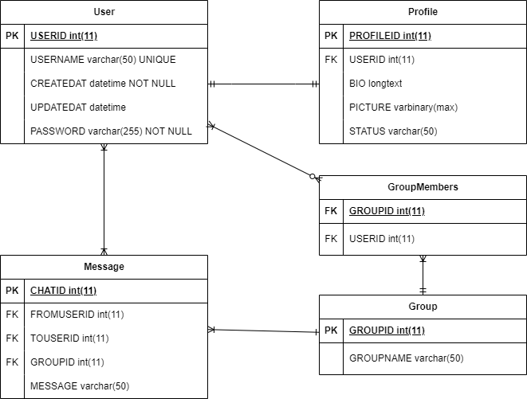

# Chirp

## Setup

-   Clone the repository

```bash
git clone https://github.com/qwerty084/LF8.git
```

-   Build docker containers

```bash
docker compose build --no-cache
```

-   Start docker containers

```bash
docker compose up --wait
```

## Using prebuilt images

```bash
docker-compose -f compose.prebuild.yaml up -d
```

## Routes

-   Next.js Frontend: http://localhost:3000
-   API: https://localhost/api
-   API Documentation: https://localhost/api/docs

## Database (ERD)


